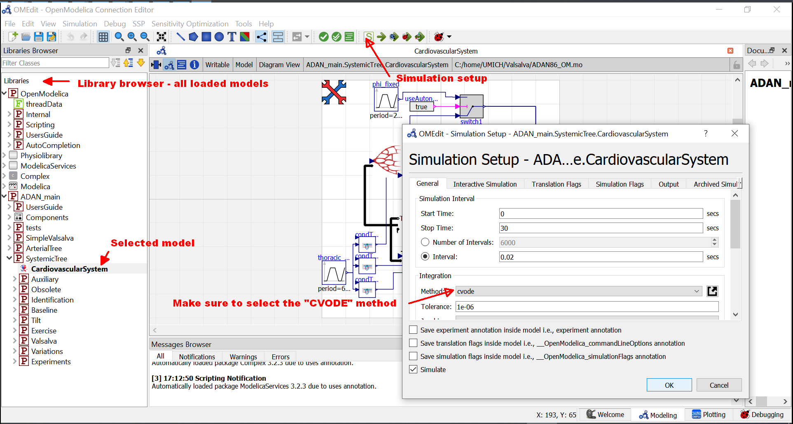
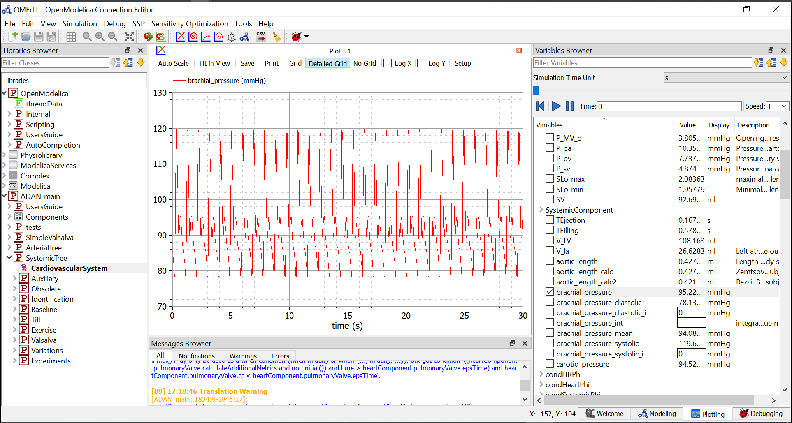

# How to run the model in OpenModelica

The OpenModelica environment is a a free open-source Modelica tool. Although it lacks some features of professional tools and their speed (the model simulates in about a half or a third time in some commercial tools) it is generally usable for both simulation and development.

## Installation prerequisites
Follow the prerequisites in https://github.com/filip-jezek/Valsalva/blob/master/README.md

## Loading the model
IMPORTANT!! The modelica source file formatting is overwritten just by loading into OpenModelica without prompt. Might cause some troubles when opened in two editors at once.

- Load Modelica Standard Library - Version 3.2.3, if not already loaded. If you are having the 4.0 version already, you can grab the former one from [Github repository](https://github.com/modelica/ModelicaStandardLibrary/tree/maint/3.2.3)
- Load the Physiolibrary 2.4
  - File - load - Physiolibrary/Physiolibrary/Package.mo
- Open the ADAN86.mo model
  - File - open - Valsalva/ADAN86.mo

## running the baseline simulation

- navigate to ADAN_main.SystemicTree.CardiovascularSystem and doubleclick to open. This is a base class, all changes applied here are inherited in other models.
- Select Simulation - Simulation Setup from the menu. Set simulation time (here 30s) and some reasonable interval (e.g. 0.02s). Make sure the **CVODE** solver is selected, as the simulation might be unstable with other solvers. Click OK. The OM editor might hang for a while, please be patient.
- Select variables to plot in right panel "Variables Browser"
- To draw X-Y plot (e.g. PV loop) select the New parametric plot button and click on the variable for X axis (e.g. V_LV and then on the variable intended for Y axis (e.g. P_LV)
- To adjust a parameter, find it in Variables browser and modify it. Click the Re-simulate button. The simulation will rerun with updated parameter value. Note, tha this change is not saved in the model.
- To return to the modeling mode, select the Modeling tab in bottom right part

{:width="100px"}

{:width="100px"}

## Running advanced use cases

- To simulate e.g. Valsalva maneuver, in *Libraries browser* navigate to ADAN_main.SystemicTree.Valsalva.CVS_Valsalva and doubleclick to open. This class inherits all from the CardiovascularSystem and adds just a setting to enable increase in airway pressure. Simulate for 60s and plot e.g. brachial pressure and HR (heart rate)
- SImilarly, one might run following use cases:
  - 60° HUT Tilt: ADAN_main.SystemicTree.Tilt.CVS_tiltable
  - 90% of maximal exercise: ADAN_main.SystemicTree.Exercise.CVS_exercise
  - Step-up exercise: ADAN_main.SystemicTree.Exercise.CVS_Exercise_stepping
  - Arterial stiffening (acute): ADAN_main.SystemicTree.Variations.Impairments.Normal.imp_arSt and after baroreflex compensation: ADAN_main.SystemicTree.Variations.Impairments.Normal.imp_arSt_ss
  - Arterial stiffening (acute): ADAN_main.SystemicTree.Variations.Impairments.Normal.imp_avRe and after baroreflex compensation: ADAN_main.SystemicTree.Variations.Impairments.Normal.imp_avRe
  - Effect of impairments on step-up exercise: All in ADAN_main.SystemicTree.Variations.Impairments.ExStepping

## Exploring the model
- Switch to the Text view and explore the code.
  - Everything is explorable through the text, no external dependencies are loaded
  - add equations and adjust parameters in the text view. Note, that all parameters here are in their base unit (i.e. SI unit)!
- Switch to the diagram view to add new components or reparametrize them
  - e.g. to simulate hemorrhage, add Physiolibrary.Hydraulic.Sources.UnlimitedOutflowPump, connect it to the pulmonary connector and double click to parametrize the outflow.
  - double-click useAutonomousPhi and set y to *false* to prevent baroreflex control

## Using Modelica
Explore additional resources about Modelica and how to use it.
 - [Modelica benefits demonstration](https://www.youtube.com/watch?v=LkAKQsur_Do)
 - [Modelica University](OpenModelica quick-start guide)
 - [PEter Fritson's book Principles of Object-Oriented Modeling and Simulation with Modelica 3.3: A Cyber-Physical Approach](https://www.amazon.com/Principles-Object-Oriented-Modeling-Simulation-Modelica/dp/111885912X)

